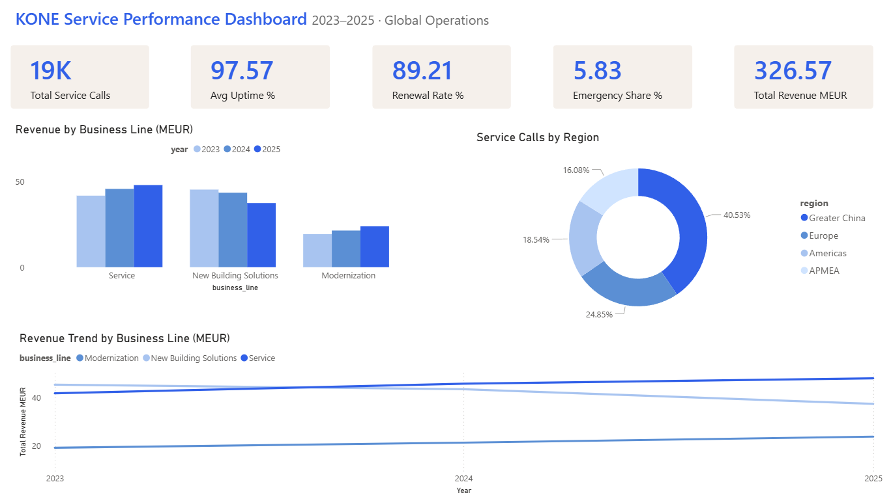
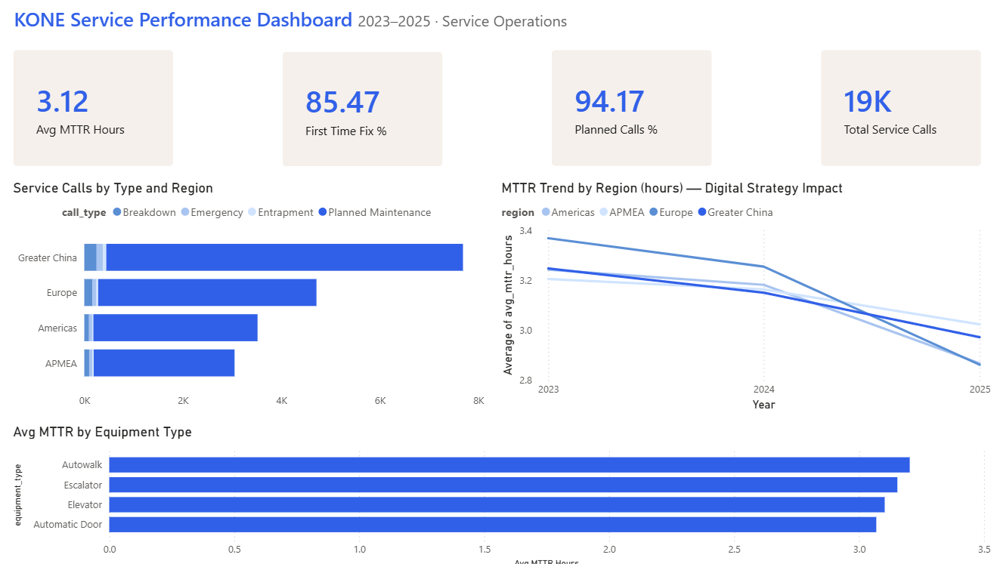
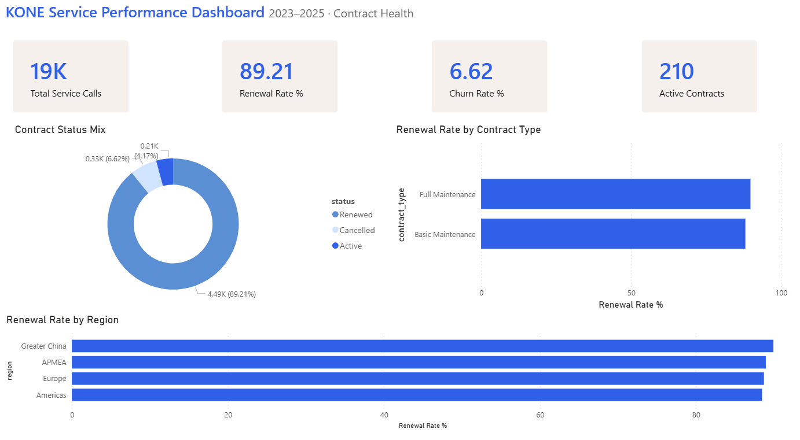
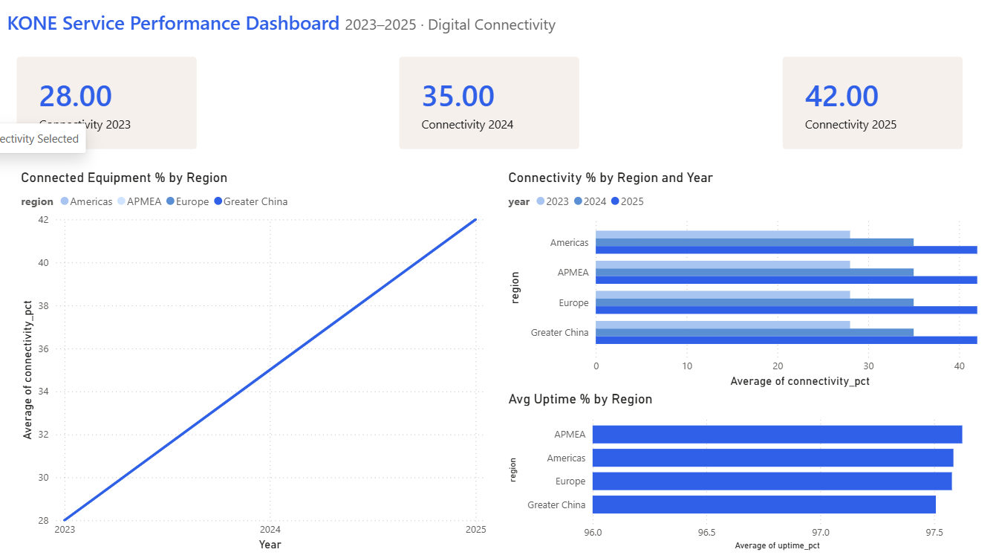
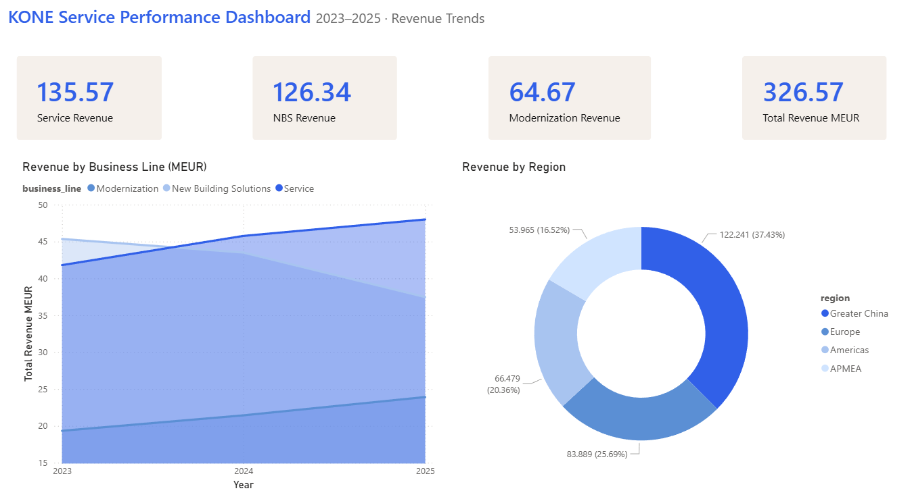

# KONE-inspired: Elevator & Escalator Service Performance Dashboard

> *Inspired by KONE's operational reporting style — not an official KONE product.*

A corporate-simulation Power BI dashboard modeled after the reporting needs of a global elevator & escalator service company.
Synthetic data proportioned from KONE's Annual Reviews 2024–2025.

---

## Business Question

**How is our global service network performing — and where are we losing value?**

A field service network of 1.8M+ units across four regions generates complex operational data.
This dashboard answers the questions a Regional VP or Service Director would bring to a Monday morning review:

- Which regions are meeting uptime SLAs?
- Where do emergency calls spike — and why?
- Is our digital connectivity strategy actually reducing MTTR?
- How healthy is the contract renewal pipeline?

---

## Dashboard Preview

### Executive Overview


### Service Operations


### Contract Health


### Digital Connectivity


### Revenue Trends


---

## Dashboard Pages

| Page | Focus |
|---|---|
| **Executive Overview** | Global KPIs: uptime %, service calls, renewal rate, revenue |
| **Service Operations** | Call breakdown (planned vs. emergency), MTTR by region and equipment type |
| **Contract Health** | Renewal pipeline, contract type mix, churn risk |
| **Digital Connectivity** | Connected units % trend, uptime lift from connectivity |
| **Revenue Trends** | Business line mix (Service / NBS / Modernization), regional revenue split |

---

## Key Metrics

| Metric | Value |
|---|---|
| Equipment units | 2,000 (demo scale; real base ~1.8M) |
| Observation period | 2023–2025 (3 years) |
| Service contract renewal rate | ~89% |
| Average uptime (2025) | 97.7% |
| Connectivity rate (2025) | 42% |
| Service revenue share | ~43% |

---

## Data Architecture

```
python/generate_data.py
        │
        ▼
data/raw/
├── equipment.csv        ← 2,000 units · region · type · age · connectivity
├── service_calls.csv    ← planned maintenance · breakdowns · emergencies · entrapments
├── contracts.csv        ← service contracts · renewal status · ~89% renewal rate
├── monthly_kpis.csv     ← uptime% · MTTR · first-time-fix rate · by region × month
└── monthly_revenue.csv  ← MEUR · by business line × region × month
```

---

## Regional Distribution

| Region | Weight | Countries |
|---|---|---|
| Greater China | 40% | China |
| Europe | 25% | Finland, Germany, France, Netherlands, Sweden, Poland |
| Americas | 19% | USA, Canada, Brazil, Mexico |
| APMEA | 16% | India, Australia, UAE, Saudi Arabia, South Korea |

---

## Revenue Model

Three business lines (proportional to KONE Annual Review 2025):

| Business Line | 2023 | 2024 | 2025 |
|---|---|---|---|
| Service | ~41 MEUR | ~45 MEUR | ~47 MEUR |
| New Building Solutions (NBS) | ~49 MEUR | ~45 MEUR | ~41 MEUR |
| Modernization | ~19 MEUR | ~21 MEUR | ~24 MEUR |

Service revenue grows as NBS cools — consistent with KONE's strategy pivot toward maintenance and modernization.

---

## Stack

| Tool | Purpose |
|---|---|
| Python (pandas, numpy) | Synthetic data generation |
| Power BI Desktop | Dashboard development, DAX measures |
| Power BI Service | Publishing and sharing |

---

## Design Style

Inspired by KONE's corporate visual language:
- Primary: KONE blue `#3160E8`
- Background: white with subtle grey separators
- Info boxes: warm beige `#F5F0EB`
- No chart gridlines; clean KPI cards with trend arrows
- Table headers: blue fill, white text

---

## Running the Data Generator

```bash
cd python
pip install pandas numpy
python generate_data.py
# → data/raw/equipment.csv
# → data/raw/service_calls.csv
# → data/raw/contracts.csv
# → data/raw/monthly_kpis.csv
# → data/raw/monthly_revenue.csv
```

---

## About

**Julia Mosina** — BI & Data Analyst  
[LinkedIn](https://www.linkedin.com/in/julia-mosina) · Espoo, Finland · Open to opportunities in Finland and EU

*This is a portfolio project demonstrating Power BI and data modeling skills.
All data is synthetic and generated specifically for this dashboard.*
